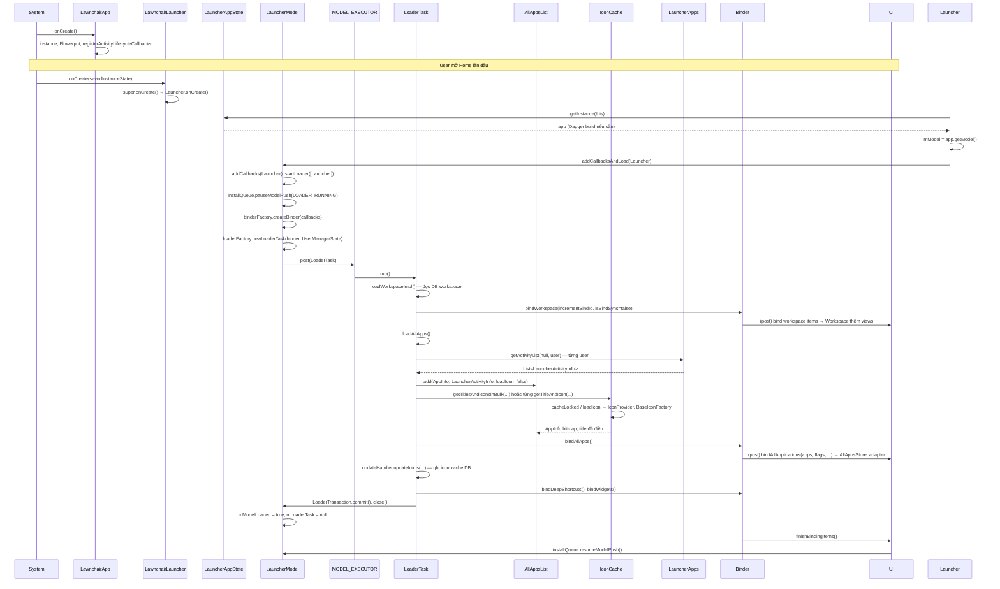

# Sơ đồ luồng khởi động Lawnchair (lần đầu)

## 1. Sơ đồ tổng quan (Mermaid)

```mermaid
flowchart TB
    subgraph Process["Process start"]
        A[LawnchairApp.onCreate] --> B[instance = this, Flowerpot, QuickStepContract]
        B --> C[registerActivityLifecycleCallbacks]
    end

    subgraph FirstLaunch["Lần đầu mở / nhấn Home"]
        D[LawnchairLauncher.onCreate] --> E[super: Launcher.onCreate]
        E --> F[LauncherAppState.getInstance]
        F --> G[Dagger init nếu chưa có]
        G --> H[mModel = app.getModel]
        H --> I[mModel.addCallbacksAndLoad(this)]
    end

    subgraph ModelLoad["Load model"]
        I --> J[LauncherModel.startLoader]
        J --> K[installQueue.pauseModelPush]
        K --> L{Tạo LoaderTask}
        L --> M[MODEL_EXECUTOR.post LoaderTask]
    end

    subgraph LoaderTask["LoaderTask.run (background)"]
        M --> N[loadWorkspaceImpl]
        N --> O[Đọc DB workspace, shortcuts, widgets]
        O --> P[mLauncherBinder.bindWorkspace]
        P --> Q[loadAllApps]
        Q --> R[LauncherApps.getActivityList]
        R --> S[AllAppsList.add AppInfo]
        S --> T[IconCache.getTitlesAndIconsInBulk / getTitleAndIcon]
        T --> U[mLauncherBinder.bindAllApps]
        U --> V[IconCacheUpdateHandler.updateIcons]
        V --> W[bindDeepShortcuts, bindWidgets]
        W --> X[commit, finishBindingItems]
    end

    subgraph UI["Main thread - bind UI"]
        P --> Y[Callbacks.bindWorkspace]
        U --> Z[Callbacks.bindAllApplications]
        X --> AA[finishBindingItems]
        Y --> AB[Workspace thêm items]
        Z --> AC[AllAppsStore, adapter cập nhật]
        AA --> AD[installQueue.resumeModelPush]
    end

    C --> D
    S --> T
```

## 2. Luồng chi tiết theo thứ tự thời gian



## 3. Các thành phần chính

| Bước | Thành phần | File / lớp | Vai trò |
|------|------------|------------|---------|
| 1 | Application | `LawnchairApp.kt` | `onCreate`: instance, Flowerpot, lifecycle callbacks. |
| 2 | Main Activity | `LawnchairLauncher.kt` → `Launcher.java` | `onCreate`: lấy LauncherAppState, Model, gọi `addCallbacksAndLoad(this)`. |
| 3 | App state / Dagger | `LauncherAppState.kt`, `LauncherApplication.java` (hoặc nơi build component) | Singleton: Context, Model, IconCache, IDP. Dagger build khi `getInstance(context)` lần đầu. |
| 4 | Model | `LauncherModel.kt` | `addCallbacksAndLoad` → `addCallbacks` + `startLoader`. Tạo LoaderTask, post lên MODEL_EXECUTOR. |
| 5 | Loader | `LoaderTask.java` | Chạy trên MODEL_EXECUTOR: load workspace DB → bindWorkspace → loadAllApps → bindAllApps → update icon cache → bind shortcuts/widgets. |
| 6 | Danh sách app | `AllAppsList.java`, `LauncherApps` | `LauncherApps.getActivityList(null, user)`; AllAppsList.add(AppInfo, ...). |
| 7 | Icon | `IconCache.java`, `BaseIconCache`, `IconProvider` | getTitleAndIcon / getTitlesAndIconsInBulk; cache memory + DB; IconProvider lấy Drawable từ PM/theme. |
| 8 | Bind UI | `BaseLauncherBinder`, `ModelCallbacks` | bindWorkspace / bindAllApplications chạy trên main thread, cập nhật Workspace và All Apps UI. |

## 4. Ghi chú

- **Lần đầu mở app**: Process khởi động → `LawnchairApp.onCreate`. Khi user chọn Home hoặc mở launcher → `LawnchairLauncher.onCreate` → `mModel.addCallbacksAndLoad(this)` → `startLoader` → LoaderTask chạy nền.
- **Model đã load sẵn**: Nếu `mModelLoaded == true` và không có LoaderTask đang chạy, `startLoader` có thể bind đồng bộ (bindWorkspace sync) rồi bind AllApps/Shortcuts/Widgets bất đồng bộ.
- **Icon**: Load trong LoaderTask qua IconCache; có thể bulk (`getTitlesAndIconsInBulk`) hoặc từng app (`getTitleAndIcon`). Kết quả ghi vào `AppInfo.bitmap` và cache DB.
